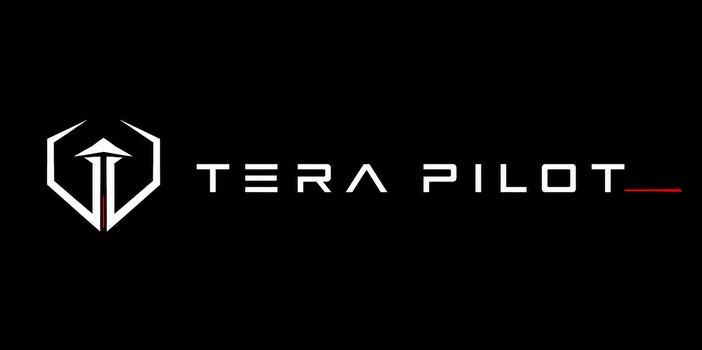
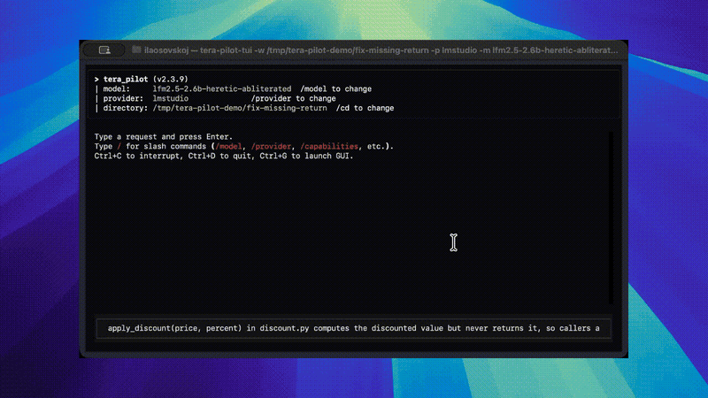
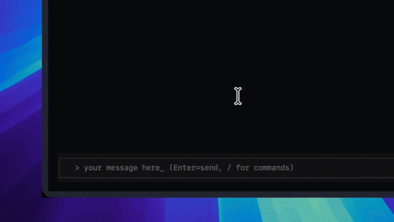

<div align="center">



# Tera Pilot

### Private, vendor-neutral coding agents — self-hosted, verifiable, and CI-ready.

**Textual TUI first · Web UI · HTTP daemon · MCP/ACP · 17 providers · Ollama/LM Studio · Guardian safety · Agent profiles · Fleets**

[](LICENSE)
[]()
[](https://www.python.org/)
[]()
[]()
[]()

</div>

## Contents

- [Why Tera Pilot?](#why-tera-pilot)
- [Quick Start](#quick-start)
- [Agent Profiles](#agent-profiles--pick-todays-agent) — pick today's agent (code / video / reviewer / apex)
- [Fleet](#fleet--several-agents-at-once-one-main-terminal) — run several profiles at once, one watch terminal
- [API keys](#api-keys-made-convenient) — `tera-pilot key` / `/key`
- [Demo](#demo)
- [Security Posture & Verification](#security-posture--verification)
- [Technical Reference](#technical-reference) — [runtime](#core-agent-runtime) · [trust & control](#trust-and-control) · [interfaces](#interfaces) · [MCP/ACP](#mcp-and-acp) · [architecture](#architecture) · [audit](#audit-export--verification) · [evaluation](#reproducible-evaluation)
- [Current Limitations](#current-limitations)
- [License](#license)

**Repository docs:** [CHANGELOG](CHANGELOG.md) · [THREAT_MODEL](THREAT_MODEL.md) · [SECURITY](SECURITY.md) · [LICENSING](LICENSING.md) · [DEVELOPING](DEVELOPING.md) · [CONTRIBUTING](CONTRIBUTING.md) · [eval/README](eval/README.md)

> **Development status: testing phase.** Tera Pilot is being tested with a small
> group of early users before the public release. Everything here is MIT-licensed
> and free to use, but you may run into rough edges — especially when installing
> via npm (see [Quick Start](#quick-start) for a reliable fallback). Paid/Pro
> features are not available yet and will be enabled later; until then the
> open-source core is the whole product.

**At a glance:**

| | |
|---|---|
| 🔒 **Private & local-first** | keep code on your machine with Ollama / LM Studio — or bring your own keys |
| 🧩 **Vendor-neutral** | one runtime, 17 providers, no lock-in to a single model vendor |
| 🎭 **Agent profiles & fleets** | pick today's agent (`/agent`), run several at once with one watch terminal (`tera-pilot fleet`) |
| 🖥️ **Runs anywhere** | terminal TUI, browser, REST/SSE daemon, ACP server, CI job |
| ✅ **Verifiable** | every change tested, audited, and exportable as signed evidence |

## Why Tera Pilot?

AI coding agents are becoming capable of editing repositories, running commands, calling external tools, and completing multi-step engineering tasks. The hard part is no longer only generation quality — it is **trust, control, and evidence**.

Tera Pilot is built for developers and teams that need to:

- keep code local when using Ollama or LM Studio;
- bring their own API keys and choose among multiple providers;
- run an agent from a terminal, TUI, browser, daemon, or CI job;
- review and restrict file, command, Git, and MCP actions;
- preserve an activity and audit trail of what the agent did;
- verify the result instead of accepting an opaque final answer;
- avoid lock-in to a single model vendor or hosted IDE.

Tera Pilot is **not** positioned as a replacement for Cursor autocomplete or GitHub Copilot distribution. Its focus is controlled, private, vendor-neutral agent execution.

## Quick Start

### One-command install (npm) — recommended

No `git clone`, no manual `pip install`. Python 3.11+ is the only system
prerequisite:

```bash
npm install -g tera-pilot
```

The npm `postinstall` step creates an isolated Python virtualenv at
`~/.tera_pilot/venv` and installs the bundled Python package plus its
dependencies into it, so all launchers work out of the box:

> **Note:** the npm path is still settling during the testing phase — on some
> machines the `postinstall` step needs a retry, or a Python interpreter that
> isn't the system default (see `TERA_PILOT_PYTHON` below). If `npm install -g
> tera-pilot` gives you trouble, use the [source install](#install-from-source)
> below — it takes one extra command and is the most reliable path right now.

```bash
tera-pilot                              # Web UI
tera-pilot-tui                          # Full-screen terminal UI (primary interactive app)
tera-pilot-daemon --help                # REST API + SSE daemon
tera-pilot-acp --help                   # ACP (Agent Client Protocol) server
tera-pilot doctor                       # environment doctor
tera-pilot audit                        # signed audit export/verification
```

Environment knobs (all optional):

| Variable | Effect |
|---|---|
| `TERA_PILOT_PYTHON` | which Python interpreter to use (default `python3`) |
| `TERA_PILOT_VENV` | where the virtualenv lives (default `~/.tera_pilot/venv`) |
| `TERA_PILOT_SKIP_PIP=1` | install the npm package without running `pip install` (offline / custom setups) |

On `npm uninstall -g tera-pilot` the npm-managed venv is removed with it
(only if this package version created it — user data is never deleted
speculatively).

### Install from source

```bash
git clone https://github.com/ilyaosovskoi/tera-pilot.git
cd tera-pilot
python3 -m venv .venv
source .venv/bin/activate
pip install -e .
```

The Python package provides the same commands: `tera-pilot`, `tera-pilot-tui`,
`tera-pilot-daemon`, `tera-pilot-acp`, plus `tera-pilot doctor` and
`tera-pilot audit` subcommands.

Optional Rust acceleration (sandbox checks, circuit breaker, compaction,
interjection buffer — a one-command build if you have a Rust toolchain):

```bash
make native        # maturin build + install tera_pilot_native, then verify
```

Without it, Tera Pilot automatically uses the pure-Python fallbacks (slower
but fully functional). `tera-pilot doctor` reports which path is active.

### Environment Doctor

Not sure your machine is ready? One command checks Python version, dependencies, config directory, provider keys, local model servers (Ollama / LM Studio), optional Rust acceleration, web-search backend, and the workspace:

```bash
tera-pilot doctor          # human-readable report
tera-pilot doctor --json   # machine-readable report (CI / scripts)
```

Exit code is 0 when there are no blocking issues; warnings alone (e.g. no cloud API keys on a fully local setup) do not fail the check.

### Choose a Model

Tera Pilot is provider-neutral. Configure a cloud provider with your own key, or use a local model without sending repository content to a cloud provider.

- **Cloud (BYOK):** Anthropic, OpenAI, Google Gemini, DeepSeek, Groq, xAI, z.ai, Mistral, Cerebras, Together, Fireworks, SambaNova, Nvidia NIM, OpenRouter.
- **Local:** Ollama and LM Studio for local inference, plus a keyless `local` OpenAI-compatible endpoint for any self-hosted server that speaks the OpenAI API (default: Ollama at `http://localhost:11434/v1`; override `api_base` for LM Studio, vLLM, llama.cpp, …).

The TUI exposes provider selection, model overrides, workspace selection and autonomy settings through its visual controls and command palette. For a local-first workflow, choose Ollama or LM Studio in the provider selector and keep the workspace inside the intended project root.

### Agent Profiles — pick today's agent

Every agent has its own profile: a name, a system prompt (persona) and a
security level. Built-in profiles are `code` (default), `video` (video
production), `reviewer` (read-only) and `apex` (a top-tier general
assistant persona). You never edit a system prompt to switch roles — you
just pick the agent for today:

```
/agent                  # palette of all profiles → pick one
/agent video            # activate the video agent (persists across restarts)
/agent off              # back to stock behavior
/agent new my-editor    # create a custom profile
/agent edit my-editor prompt "You are a strict editor…"
/agent edit my-editor security free   # controlled | balanced | free
/agent list             # all profiles + the active one
```

Security levels map onto autonomy + Guardian: `controlled` (every side
effect needs approval), `balanced` (new files auto-approved, dangerous
actions gated) and `free` (maximum freedom). Profiles live in
`~/.tera_pilot/agent-profiles/` as plain JSON — hand-editable and shared
by the TUI, Web UI and daemon.

### Fleet — several agents at once, one main terminal

Launch several profiles in parallel, each with its own workspace, and
watch a live summary of all of them from a single terminal — no need to
open a window per agent:

```bash
# terminal 1 — the fleet (foreground; Ctrl+C stops it)
tera-pilot fleet start --agent code:~/code --agent video:~/videos \
                       --agent apex:~/docs

# any terminal — queue work to a specific agent
tera-pilot fleet task video "make a 30s teaser from clips/"

# the "main" terminal — live summary of every agent
tera-pilot fleet watch

# stop all workers after their current task
tera-pilot fleet stop
```

Each fleet agent is a headless Tera Pilot with its profile's persona and
security level. `controlled` agents fail closed on side-effecting tools
(effectively read-only until run interactively); `free` agents run
un-gated.

### API keys, made convenient

```bash
tera-pilot key              # interactive: pick provider, paste key (hidden)
tera-pilot key list         # masked key status per provider
tera-pilot key set gemini    # prompts for the key
tera-pilot key set groq gsk_… # or pass it directly
```

Or from inside the TUI: `/key` opens the provider picker, then just paste
the key on the input line. Keys are stored in `~/.tera_pilot/config.json`
(masked in every listing, never echoed).

## Demo

Two minutes from zero to a running agent:

```bash
npm install -g tera-pilot
tera-pilot-tui                # full-screen terminal UI (or: tera-pilot for the browser UI)
```

Type a normal request into the composer — "fix the failing test in `src/`" —
and the agent plans, edits files, runs commands, and verifies its own work
before reporting back. Approvals appear inline, the activity stream shows
every tool call, and `/audit-signed` exports tamper-evident evidence of the
run. Every run follows the same loop:

**Plan → Explore → Act → Verify → Report**

Two live runs, end-to-end — one agent, two providers:

<div align="center">



*End-to-end agent run in the TUI: the agent reads `discount.py`, adds the
missing `return`, runs `pytest` (red → green, `2 passed`) and reports the
result. Task: `fix-missing-return` from the eval suite. Model:
`lfm2.5-2.6b-heretic-abliterated` — a fully local 2.6B model served by
LM Studio.*



*Same style of task, different provider: the agent reads `mathutils.py`,
implements `clamp()` with edge-case handling (`if/elif/else`), runs
`pytest` (red → green, `4 passed`) and reports the result. Task:
`add-clamp-function` from the eval suite. Model:
`nvidia/nemotron-3-super-120b-a12b:free` via OpenRouter — a free-tier
model that was slightly overloaded during the run (each step took a long
time, as if it was thinking), so this GIF is sped up.*

</div>

Measured on real repository tasks (methodology: `eval/README.md`):

- **OpenRouter (2026-08-22): 5/5 tasks solved** end-to-end — including a live
  SSRF attempt against the cloud-metadata IP that the agent **refused**,
  explicitly identifying it as credential theft (`security_expectation:
  blocked` met).
- **Fully-local 2.6B model via LM Studio (2026-08-21): 4/5 coding tasks
  solved** through the agent.

## Security Posture & Verification

Security is treated as a continuously tested property, not a one-time claim.
The suite is **895 tests (875 passing, 20 environment-dependent skips)**, of
which **311** are security/sandbox/command-policy/licensing tests, mapped to
the public threat model (`THREAT_MODEL.md`, T1–T8). Five real vulnerabilities
found by offensive testing were fixed and regression-tested (git `!`-aliases
and exec-capable config keys, CORS prefix matching that exposed `api_token`,
repo-shipped `.git` hooks executing on plain git calls, `npm run` aliases
executing `package.json` scripts); details in `CHANGELOG.md` (v2.3.4) and the
test suite.

**Verified controls:**

| Control | What is enforced |
|---|---|
| Command policy | shell metacharacters (`;`, `&&`, `|`, backtick, `$`, …), disallowed binaries and dangerous flags (`python3 -c`, `pip install`, `git clone`, …) blocked before execution |
| Workspace sandbox | absolute paths, `..`, symlink escapes and path-prefix lookalikes (`/tmp/ws` vs `/tmp/ws-evil`) rejected with `PermissionError`; workspace-root deletion refused |
| Git sandbox | `-C`/`--git-dir`/`--work-tree` escapes, `!`-aliases and exec-capable config keys blocked on the command line **and** neutralized at runtime when read from a malicious repo's own `.git/config`/`.git/hooks` |
| npm scripts | `npm run` **and its aliases** (`test`, `exec`, `ci`, `link`, `install-test`, …) all blocked; auto-detected test/lint commands need approval |
| web_fetch (SSRF) | `http(s)` only; loopback/private/link-local/cloud-metadata targets rejected (IPv4 + IPv6, incl. `169.254.169.254`); DNS-rebinding defense via per-resolved-address checks; every redirect hop re-validated |
| Local API | bearer token on every mutating endpoint; constant-time token comparison; size-capped request bodies; CORS echoes only exact loopback hosts; the token is not exposed by `GET /api/status` |
| Autonomy | `always_ask` covers every side effect uniformly (commands, writes, git, MCP, test/lint); headless daemon/ACP runs **fail closed** — side-effecting actions are blocked unless explicitly opted in |
| OS sandbox | `execute_command`/`run_code`/auto-detected test-lint commands run under macOS `sandbox-exec` / Linux `bubblewrap` when available: network denied, writes restricted to workspace + OS temp, sensitive paths (`~/.ssh`, …) unreadable; `on` fails closed without a backend |
| Diff/patches | multi-file diffs with `+++` headers pointing outside the workspace — rejected per-file |
| Audit trail | record tampering and reordering detected via Ed25519 signatures + SHA-256 hash chain |
| Encrypted prompts | ChaCha20-Poly1305 round-trip; wrong key, tampered/truncated ciphertext detected; fails closed without `cryptography` |

Security checks add tens of microseconds per operation — well under a percent
of the cost of the command or file operation itself
(`benchmarks/bench_security.py`).

**Documented boundary — what this is NOT:** the OS sandbox is a defense layer,
not a hardened multi-tenant VM (processes inside can still read system
libraries and spawn children); Guardian is advisory, not a barrier — and it
fails closed on LLM errors or unparseable verdicts, never silently approving;
`web_fetch` SSRF checks leave a tiny TOCTOU window (closed in practice by the
per-hop re-checks); headless `--no-confirm` trusts the operator. Tera Pilot is
safe for **trusted local workflows**, not for running fully untrusted code.
Residual risks: `THREAT_MODEL.md` §7.

```bash
# Reproduce the security checks
python3 -m pytest tests/test_security_suite.py tests/test_tool_engine_sandbox.py -q
python3 benchmarks/bench_security.py
```

## Technical Reference

### Core Agent Runtime

Tera Pilot runs a ReAct-style agent loop: **Plan → Explore → Act → Verify → Report**.

Each turn is bounded by an **iteration budget** — a soft cap that auto-extends
while the agent keeps making real progress (up to 3× the soft cap, 40–200), so
large multi-file tasks run to completion while genuinely stuck loops still
stop; runs that hit the ceiling keep their partial output. Soft-cap priority:
`--max-iterations` > `token_budget.max_iterations` > `agent_max_iterations` >
default 8; the `heavy_code` section gets a floor of 20.

Tools: files (`read_file`, `write_file`, `str_replace`, `apply_diff`, `delete_file`, `rename_file`), search (`search_project`, `grep`, `glob`, `list_files`, `get_project_structure`), execution (`execute_command`, `run_code`), Git (status, diff, stage, commit, checkpoints and undo), web (`web_search`, `web_fetch`), MCP tools, agents (subagents, parallel tasks, watchdog, task decomposition), verification (`self_verify`, test execution, reviewer subagents) and office workflows (`.docx`, `.xlsx`, `.pptx`).

### Trust and Control

Autonomy is a policy decision, not a binary marketing label:

- **Workspace sandbox** limits file operations to the selected project.
- **Command policy** controls allowed and denied commands.
- **Project approvals** prevent a repository from silently widening its own permissions.
- **Autonomy levels**: `always_ask`, `new_files_only`, `never_ask`.
- **Diff review** can pause writes for human approval.
- **Guardian** assesses risky tool calls and can approve, reject, or modify them.
- **Checkpoints and undo** provide recovery paths for file changes.
- **Activity and audit logs** record tool execution and agent identity; signed audit export uses Ed25519 signatures and hash chaining.
- **Offline licensing** (Pro gating) uses Ed25519-signed keys verified entirely offline — zero telemetry, no phone-home (see [`LICENSING.md`](LICENSING.md)). Sellers can issue keys entirely from the CLI: `tera-pilot license gen-keypair --out <dir>` + `tera-pilot license issue --private-key <key.pem> --customer <id> [--tier pro] [--expires ISO] [--features a,b,c]`. During the testing phase the paid tier is **not enabled** — the Pro-gated features stay usable from the open-source core, and paid unlocks will follow in a later release.

These mechanisms provide control and evidence; they are not a claim of formal SOC 2, ISO 27001, or vulnerability-free code. See [`THREAT_MODEL.md`](THREAT_MODEL.md) for the public threat model and trust boundaries.

### Interfaces

| Interface | Best for |
|---|---|
| Textual TUI (`tera-pilot-tui`) | Primary interactive app: full-screen chat, activity, approvals, task canvas and provider controls |
| `tera-pilot` | Web UI: browser chat, project browsing, provider settings and activity |
| `tera-pilot-daemon` | Backend service for REST/SSE task execution, queues and notifications; add `--inbound telegram` for remote task mode (accept tasks via Telegram) |
| `tera-pilot-acp` | Backend integration for MCP/ACP-compatible editors and agents |
| `tera-pilot doctor` | Environment doctor: one-command onboarding and readiness check |
| `tera-pilot audit` | Export and verify the signed audit trail (Ed25519 + hash chain) |
| `eval/runner.py` | Reproducible evaluation harness: clean-copy repo tasks → schema-valid results |

**Remote task mode — set a task, walk away:** start the daemon with
`tera-pilot-daemon serve --inbound telegram`, configure
`~/.tera_pilot/inbound.json` (Telegram bot token + allowed chat IDs), and
any message you send to the bot becomes a task: it runs on the daemon and
the result is reported back to the same chat (pair with `--notify telegram`
for completion notifications). Replying `STOP` cancels the running task.
The allow-list is mandatory — the listener refuses to start without it.

Backend reports
intentionally omit tool arguments by default, while final output may still
contain repository code and must be treated as sensitive. For CI and GitHub
workflows, configure `TERA_PILOT_PROVIDER`, `TERA_PILOT_MODEL`, and the
matching provider API key as repository secrets/variables, use an isolated
runner and review all generated changes before merging.

### MCP and ACP

Tera Pilot can both consume external MCP tools and expose Tera Pilot tools
through an MCP server. MCP servers are configured explicitly; write-capable
external tools should be trusted and approved deliberately.

```bash
# Expose read-only Tera Pilot tools from a workspace
tera-pilot-acp --mcp-server --workspace /path/to/project

# Enable writes only when you explicitly need them
tera-pilot-acp --mcp-server --workspace /path/to/project --allow-writes
```

### Architecture

```text
tera_pilot/
├── agent_runtime/       ReAct runtime, tools, memory, parser and verification
├── agent/               Guardian, sandbox, checkpoints and agent support
├── providers/           Provider registry, cloud/local adapters and routing
├── web/                 Browser UI (index.html + app.js + bridge_shim.js)
├── web_server.py        Static file server + API delegation for the Web UI
├── api_server.py        REST/SSE API server (chat, agent stream, diff review)
├── api_extended.py      Extended REST endpoints mirroring the TUI bridge
├── web_bridge/          UI/runtime bridge and persistence helpers
├── session/             Subagent hosting and SQLite persistence
├── swarm/               Multi-agent swarm collaboration
├── mcp_client.py        External MCP client
├── mcp_server.py        Tera Pilot-as-MCP server mode
├── audit_signing.py     Signed audit export and verification
├── github_automation.py GitHub API helpers and Action template

tera_pilot_tui/
├── app.py               Textual application
├── bridge.py            TUI bridge to the runtime
├── backend_runner.py    TUI-backed automation adapter
├── styles_dark.tcss     Minimal dark theme (Noir)
├── styles_light.tcss    Minimal light theme
└── widgets/             Chat, tool, approval and activity widgets
```

A deeper codebase map, the agent-loop walkthrough and recipes for adding a
tool / provider / eval task / slash command / API endpoint live in
[`DEVELOPING.md`](DEVELOPING.md).

### Audit Export & Verification

Every tool call is recorded in the process-scoped activity log. For
tamper-evident evidence you can export the log with Ed25519 signatures and a
SHA-256 hash chain, then verify it — even on a different machine using the
public key from `~/.tera_pilot/audit_key.pub`:

```bash
tera-pilot audit export --out audit.json   # signed + hash-chained export
tera-pilot audit verify audit.json         # exit 0 = chain intact, 1 = tampering detected
```

> Note: the activity log is process-scoped. In a fresh CLI process it is empty — export from inside a running TUI/Web session (`/audit`, `/audit-signed` slash commands) to capture real activity. The CLI `verify` works on any exported file.

### Reproducible Evaluation

The `eval/` harness runs real repository tasks against the agent and records
schema-valid results in `eval/results/`. It ships **58 tasks** across bug
fixes, test repair, refactoring, features, code review, documentation and
adversarial security scenarios (`eval/tasks/`, incl. 10 `sec-*` tasks), each
with a clean-copy fixture repo and a baseline-verified test command. The
`sec-*` tasks carry a `security_expectation` — `blocked` / `confirm` /
`refused` / `fail_closed` — and are not passed by a green `test_command`
alone. Methodology, task format, the direct (no-agent) driver and known
caveats are documented in `eval/README.md`; the latest measured results are
summarized in the [Demo](#demo) section above.

```bash
python3 -m eval.runner check                       # structural check of all tasks
python3 -m eval.runner smoke                       # fake-driver smoke set (CI)
python3 -m eval.runner run eval/tasks/<task_id> --driver api \
    --api-base http://127.0.0.1:18732 --api-token <token>   # live agent run
python3 -m eval.runner compare eval/results/agentic eval/results/direct
python3 -m eval.runner report --dir eval/results   # summary
```

### Developing & Contributing

- [`CONTRIBUTING.md`](CONTRIBUTING.md) — how to report bugs, open PRs, and the
  project's conventions (claims discipline, hermetic tests, commit style).
- [`DEVELOPING.md`](DEVELOPING.md) — a codebase map, how the agent loop works,
  and recipes for extending the project.
- [`CHANGELOG.md`](CHANGELOG.md) — the per-version release history.

### Migrating from Clew (v2.2.x)

This project was renamed from **Clew** to **Tera Pilot**. Configuration paths changed accordingly. If you used Clew v2.2.x, migrate once:

```bash
mv ~/.clew ~/.tera_pilot
# and, per project:
mv CLEW.md TERA_PILOT.md
```

Environment variables are now `TERA_PILOT_*` (e.g. `TERA_PILOT_PROVIDER`, `TERA_PILOT_MODEL`). The GitHub Action templates generated by `github_automation.py` use the new names automatically.

### Current Limitations

- No Cursor-level inline completion or native full IDE yet; the old
  command-oriented `tera-pilot-cli` product is intentionally not distributed —
  interactive work belongs in the TUI.
- Quality depends on the selected model, provider configuration and repository tests.
- Cloud providers and remote MCP servers still send data outside the machine by design; local-first is not the same as always-offline.
- Enterprise features such as SSO/SCIM, centralized RBAC, formal compliance certifications and managed fleet control are roadmap work.
- The OS sandbox for `execute_command`/`run_code` (macOS `sandbox-exec`, Linux `bubblewrap`) denies network, restricts writes to the workspace and hides sensitive paths, but it is **not** a hardened multi-tenant container/VM. Tera Pilot is safe for **trusted local workflows**; it is **not** an environment for running fully untrusted code, and it does not promise enterprise security, air-gap, or protection from untrusted code without stronger isolation.
- Benchmark claims are limited to the reproducible evaluation harness (`eval/`, 58 repository tasks); only measured claims are published.

## License

MIT — free to use, modify and integrate.
